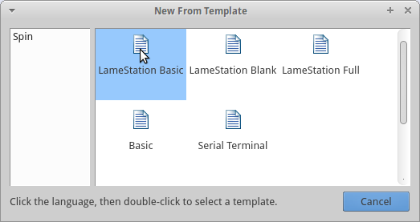

# Step 1: Using Templates

To begin this tutorial, we'll start with the LameStation Basic template.
In PropellerIDE, you can create a new project from a template with
++ctrl+shift+t++.



Once created, save the template as `Snake.spin`, and make sure you save
it somewhere you can find it again.

**Snake.spin**

```spin
CON
    _clkmode = xtal1 + pll16x
    _xinfreq = 5_000_000

OBJ
    lcd  : "LameLCD"
    gfx  : "LameGFX"
    ctrl : "LameControl"

PUB Main
    lcd.Start(gfx.Start)
    ctrl.Start

    ' add your code here
```
