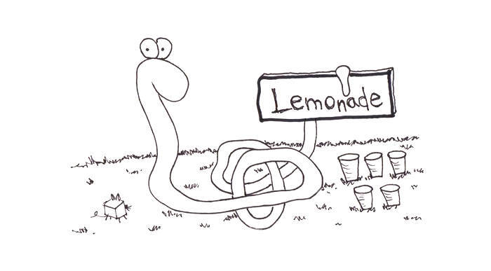
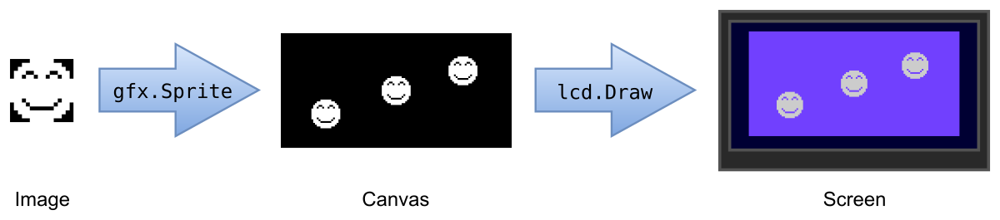

# Section 2: Humble Beginnings

Last time, we showed you how to set up a basic Spin template, but you
still haven't seen it do anything.

Now that that's out of the way, let's do something. Here's a lofty goal:
let's make the LameStation draw something.

There are three steps to using graphics in a program.

1.  Add graphics data to your program

2.  Use to draw screen image

3.  Send image to actual screen

