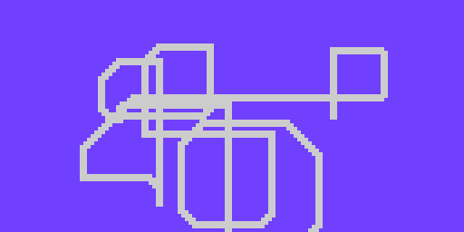

# Step 4: Feeling Loopy

Awesome. We should be ready to go, right? Wrong!

There's one thing missing. You see, the most you'll ever be able to move
the dot is by one pixel. That's because our code is only run once. If
you really want to see it move, you need a _loop_, or code that will run
over and over again. Spin has the `repeat` command for this.

```spin
repeat
    foo(bar)
```

To put your code inside a `repeat`, just put it after and indent it, and
it'll loop forever! Don't just put the controls though. You need the
drawing code too, like this.

**Snake.spin**

```spin hl_lines="4-17"
    snakex := 32
    snakey := 32

    repeat
        ctrl.Update

        if ctrl.Left
            snakex--
        if ctrl.Right
            snakex++
        if ctrl.Up
            snakey--
        if ctrl.Down
            snakey++

        gfx.Sprite(@dot_gfx, snakex, snakey, 0)
        lcd.Draw
```

You'll notice right away something really wonky. The snake is leaving a
giant trail of snake behind it, to the point that this seems more like a
paint program.



`gfx.Clear` to the rescue! This command clears the screen to black, and
should be called any time you need to _reset_ the screen. Usually the
best place for it is the beginning of the loop.

**Snake.spin**

```spin hl_lines="5"
    snakex := 32
    snakey := 32

    repeat
        gfx.Clear
        ctrl.Update

        if ctrl.Left
            snakex--
```
