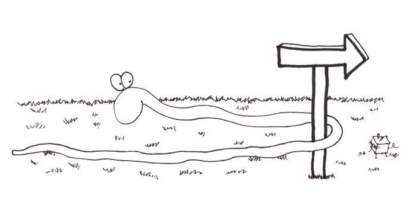

# Section 4: A New Direction

<figure>
    
</figure>

In the last section, we got the dot to move around the screen based on
our joystick input, and prevented it from going outside the screen.

Now, we want to introduce some actual game behaviors. If you've ever
played Snake, what makes it difficult is that the snake is always
moving, whether you're pressing on the controls or not. You can achieve
this is by giving the snake a _direction_.
