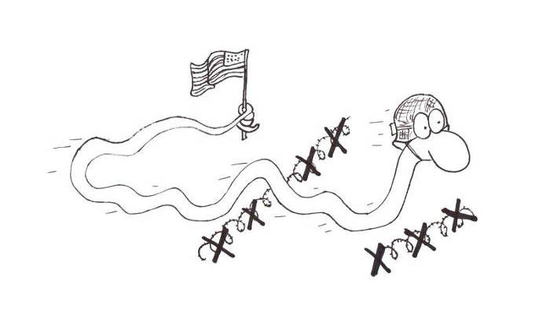

# Section 5: Leading The March

In Snake, for every frame, the snake moves forward one pixel, with each
pixel following after it.

    ■ ■ ■ ■ ■           ' frame 1
      ■ ■ ■ ■ ■         ' frame 2
        ■ ■ ■ ■ ■       ' frame 3

So how do we emulate that? We basically need to do everything we've done
up to this point, times however long the snake is. Two bytes for x and y
clearly won't be enough. We're going to need arrays.
