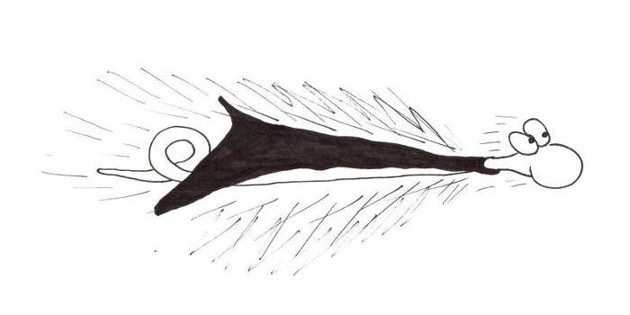

# Section 6: Going Faster

<figure>
    
</figure>

During the last exercise, you found that as the length of your snake
increased, your game actually slowed down. _A lot_.

This may seem surprising, considering that you've probably seen
LameStation games where a lot more is happening on the screen and it
seems to be running just fine.

That's because as it is, our code is not very efficient.

1.  LameGFX is designed for drawing full images, so it's not so good at
    drawing individual pixels.

2.  Every time the snake moves by one point, it has to move every single
    dot in its body, one at a time, which takes a long time.

3.  The snake is moving one pixel at a time, when the dot is 2x2 pixels.

There isn't much we can do about \#1, other than write a whole new
graphics library (which would take a long time!). \#2 can be fixed, but
it'll complicate the code, so we'll save that for a rainy day.

For now, let's deal with the third problem, because it's the easiest. If
each snake dot is 2x2 pixels, then why not make the snake move two
pixels at a time? Otherwise, each image is pointless overlapping the
last one which is unnecessary.
