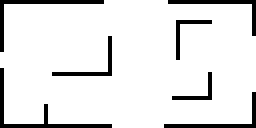
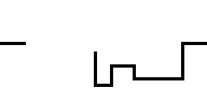

# Instructions

Pick one task from Group A and two tasks from Group B:

## Group A

1.  **Build walls to crash into**:

    Your goal is to create a wall that the snake can crash into. It can
    be as simple as a border wall surrounding the screen, or as complex
    as a crazy maze.

    

2.  **Enemies to come after you**:

    Create one (or many) enemies that can make life difficult in some
    way, like chasing you around the screen, or moving back and forth.

## Group B

1.  **Fancier graphics**: No explanation needed.

2.  **Scorekeeping**: Track the longest snake length as your score, and
    display both your score and the best on the screen in between games.

3.  **Speed it up**: Increase the speed of the snake as it gets longer.
    Make sure that when you're moving faster, you can't accidentally
    skip over food.

4.  **Powerups**: Create items that appear like food, but alter the
    gameplay in some other way, like:

    - _decreasing_ the length of the snake

    - providing time-limited immortality

    Be sure to provide a visual indicator that a powerup is active.

5.  **Around the World**: The snake will no longer die if it hits the
    edge of the screen. Instead, the snake will continue on the opposite
    side of the screen.

    
