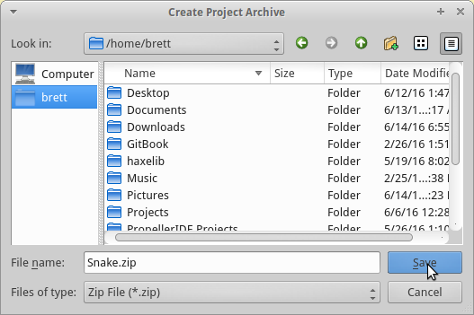

# Submissions

## How to submit your work

1.  Open your game in PropellerIDE.

    

     

1.  Click Project Archive button.

    

     

1.  Save your project somewhere you can find it. It will be saved as a `.zip` file.

    

     

1.  Send the archive to your teacher.
